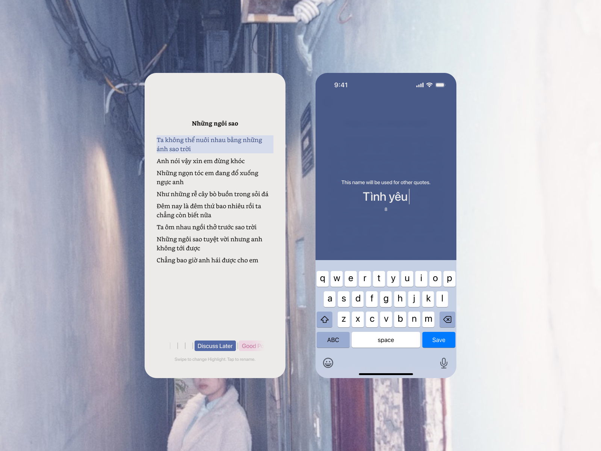
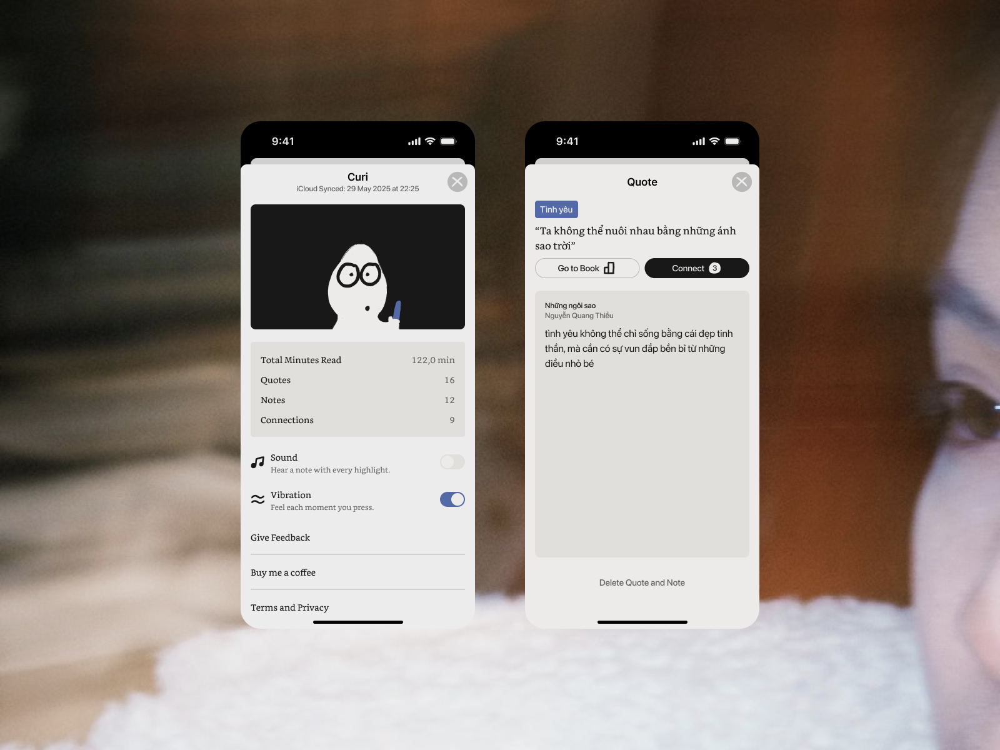

# 📚 Curi

**Curi** is an online reading app designed for readers who want more than just turning pages. Unlike other reading apps, Curi empowers you to **highlight, store, and connect meaningful quotes** — all within the app. No need to switch to third-party tools or note apps.

> **Read. Highlight. Repeat**

---

## ✨ Key Features

- 📖 Read books online with a clean, distraction-free interface  
- 🔖 Highlight and save your favorite quotes  
- 🔗 Link related quotes together to form your own knowledge network  
- 🧠 Revisit saved quotes anytime — even from the Home Screen with Curi’s Widget
- ☁️ Sync highlights and links seamlessly across devices via iCloud

---

## 🧠 Why Curi?

Most reading apps stop at letting you highlight.  
Curi goes further — it helps you **build relationships between ideas**, right from your reading experience. No exporting. No extra apps. Just seamless thinking and reading.

---

## 🛠️ Tech Stack

- SwiftUI (iOS 17+)
- SwiftData + CloudKit
- MVVM Architecture
- CloudKit (iCloud Sync)

---

## 📸 Screenshots





---

## 🚀 Getting Started

1. Clone the repository:
```bash
git clone https://github.com/nguyenlamhai89/Curi
```

2. Open the project in XCode
```bash
open CuriApp.xcodeproj
```

3. Build and run on an iOS 17+ simulator or physical device
_⚠️ Make sure you’re signed into an iCloud account for CloudKit sync._

---

## 📝 Resources

- UX Research and Data Synthesis (Vietnamese): https://docs.google.com/spreadsheets/d/1Fdhy5OKKaLoFztyylyfJ0OPHrFDbdFujWPZ8oFEkvFM/edit?gid=0#gid=0
- UI Design: https://www.figma.com/design/uckdhDjeK6om6nBHLODxP8/%F0%9F%92%A6-curi---Design?node-id=69-4143&t=BB3jGDw1El1JhUnM-1

